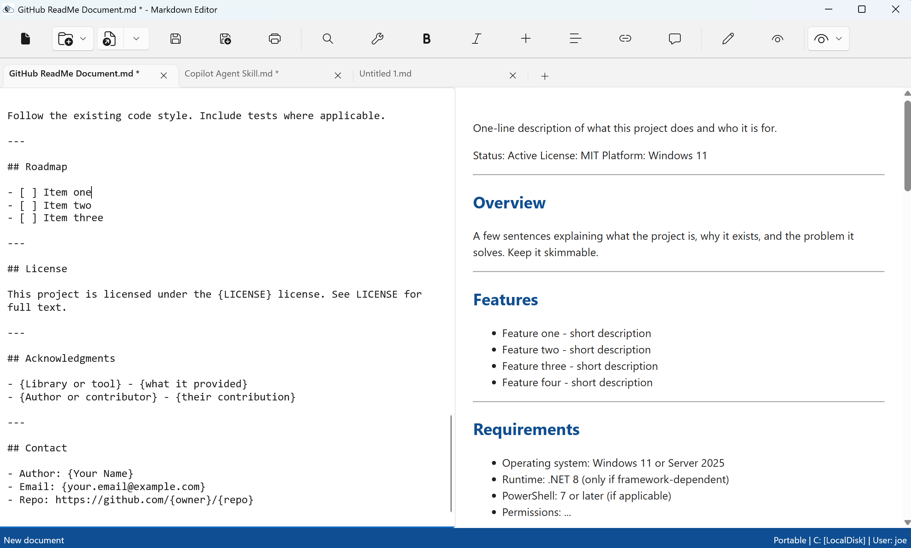

# Markdown Editor

A portable, self-contained WinUI 3 Markdown editor for Windows 11 and Server 2025, built for IT professionals writing SOPs, runbooks, README files, and Copilot agent instructions.

Status: Active
License: MIT
Platform: Windows 11 / Server 2025

---

---

## Overview

Markdown Editor is a self-contained, portable desktop application for authoring and previewing Markdown documents. It requires no installation, no registry changes, and no admin rights — extract the folder anywhere (USB drive, network share, or local disk) and run the executable.

All settings, autosaves, backups, and logs are stored alongside the executable in a per-user profile folder, so your work travels with the application folder. When running from a read-only location, it falls back gracefully to `%LOCALAPPDATA%`, making it ideal for locked-down enterprise deployments.

---

## Features

- **Multi-tab editing** - Open multiple documents at once, each with its own editor, live preview, and independent undo history.
- **Live preview** - Renders Markdown to HTML in real time using Markdig and a Chromium-based WebView2 control, with full support for tables, fenced code blocks, task lists, and footnotes.
- **PDF export** - Render the current document to a theme-aware PDF that opens automatically in your default viewer.
- **Find and Replace** - Ctrl+F / Ctrl+H search scoped to the active tab, with match case, whole word, match counter, and undo-safe Replace All.
- **Templates** - Ships with four starter templates (SOP, GitHub README, Copilot Agent Instruction, Copilot Agent Skill); add your own by dropping `.md` files into the Templates folder.
- **Editing shortcuts** - Bold/italic, heading toggles (Ctrl+0-4), and automatic list continuation with Tab/Shift+Tab indentation.
- **Theming** - Light, Dark, and System themes applied across all open tabs and preview panes.
- **Crash-safe autosave** - Per-tab drafts autosave to disk and restore automatically on next launch.

---

## Requirements

- Operating system: Windows 11 or Windows Server 2025 with Desktop Experience
- Runtime: None required - self-contained build bundles the .NET 8 runtime and Windows App SDK
- PowerShell: 7 or later (only for the build/publish scripts)
- Permissions: No installation or admin rights required; read-only deployment supported with `%LOCALAPPDATA%` fallback

---

## Installation

No installation required. Download the portable ZIP, extract it anywhere, and run the executable:

    Expand-Archive MarkdownEditor-Portable-v2.0.0.zip -DestinationPath C:\Tools\MarkdownEditor
    cd C:\Tools\MarkdownEditor
    .\MarkdownEditor.exe

To build from source:

    git clone https://github.com/{owner}/{repo}.git
    cd {repo}
    dotnet build

To produce a portable release ZIP:

    .\publish.ps1 -Version 2.0.0

---

## Quick Start

1. Launch `MarkdownEditor.exe`. A `Data` folder is created alongside the executable to hold your profile.
2. Start typing in the left editor pane - the right preview pane updates automatically.
3. Save with **Ctrl+S** (a Save As dialog appears the first time).
4. Open additional documents in new tabs with the **+** button, or start from a template via **New from Template**.

Everything you type is autosaved every few seconds. You can close the app at any time without losing work; all open tabs restore on next launch.

---

## Configuration

Configuration lives in `Data\Profiles\<username>\Settings\Settings.json`. Key options:

| Setting | Default | Description |
|---|---|---|
| Theme | System | Editor theme: System, Light, or Dark |
| MaxBackups | 25 | Number of timestamped backups retained per file |
| Autosave interval | 5s | Delay after last edit before a draft is written |
| RestoreSessionOnLaunch | true | Reopen all previously open tabs at startup |

---

## Usage Examples

### Example 1 - Author an SOP from a template

Click **New from Template** (folder icon) and select **Standard SOP Document**. A new tab opens pre-loaded with a structured SOP skeleton (Purpose, Scope, Roles, Steps, Verification, Revision History). Fill in the placeholders and save.

### Example 2 - Export a runbook to PDF

Open or write your document, then click **Export PDF**. Choose a destination; the PDF preserves your current theme, uses 0.75-inch margins, and opens automatically in your default viewer.

---

## Project Structure

    MarkdownEditor/
    ├── Models/           # Document model and snapshots
    ├── ViewModels/       # MainViewModel, DocumentViewModel, commands, MVVM base
    ├── Services/         # Logging, settings, autosave, file, template, PDF export
    ├── Helpers/          # AppFolders, portable detection, Win32 dialogs
    ├── Templates/        # Starter Markdown templates (shipped with the app)
    ├── Docs/             # UserGuide.md, UserGuide.html, build-docs.ps1
    ├── Assets/           # App icon
    ├── MainWindow.xaml   # Tabbed editor UI
    ├── App.xaml          # Application entry and service initialization
    ├── publish.ps1       # Versioned portable-release build script
    └── README.md

---

## Contributing

1. Fork the repository
2. Create a feature branch (git checkout -b feature/my-thing)
3. Commit your changes
4. Push to the branch
5. Open a pull request

Follow the existing code style. Include tests where applicable.

---

## Roadmap

- [ ] Right-click tab context menu (Close Others, Close All, Copy Path)
- [ ] Tab rename via right-click
- [ ] Split view (two documents side by side)
- [ ] Restore last-active tab as active on session restore

---

## License

This project is licensed under the MIT license. See LICENSE for full text.

---

## Acknowledgments

- Markdig - Fast, CommonMark-compliant Markdown parsing and HTML rendering
- WebView2 (Windows App SDK) - Chromium-based live preview and native PDF export
- Windows App SDK / WinUI 3 - Modern Windows desktop UI framework

---

## Contact

- Author: Joe Paulson
- Repo: https://github.com/TheJoePaulson/Markdown-Editor/